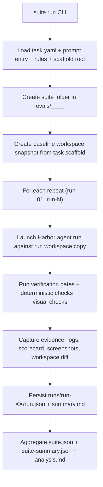
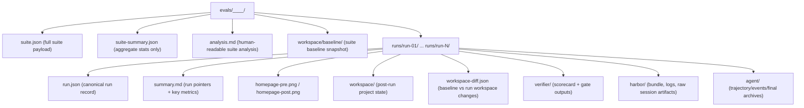

<div align="center">

<h1>Raidar</h1>

**Task evaluation of Cli harness + model pairs to improve delivery performance using Harbor-based execution**


<p>
  <a href="#quick-install">Quick Install</a> •
  <a href="#start-here-2-minutes">Start Here</a> •
  <a href="#orchestrator-flow">Flow</a> •
  <a href="#eval-suite-layout">Eval Layout</a> •
  <a href="CHANGELOG.md">Changelog</a> •
  <a href="analyze-results.md">Analyze Prompt</a>
</p>

</div>

---

## Table of Contents

- [Quick Install](#quick-install)
- [Start Here (2 Minutes)](#start-here-2-minutes)
- [System Overview](#system-overview)
- [Orchestrator Flow](#orchestrator-flow)
- [Task Model](#task-model)
- [Eval Suite Layout](#eval-suite-layout)
- [Common Commands](#common-commands)
- [Cleanup](#cleanup)
- [Changelog](#changelog)

## Quick Install

Prerequisites:

- `uv` ([installation](https://docs.astral.sh/uv/getting-started/installation/))
- Docker with `docker compose`
- One provider API key in `orchestrator/.env` (`OPENAI_API_KEY`, `ANTHROPIC_API_KEY`, `CLAUDE_CODE_API_KEY`, or `GEMINI_API_KEY`)

Bootstrap the orchestrator environment:

```bash
cp orchestrator/.env.example orchestrator/.env
# Edit orchestrator/.env and set your provider key(s)
cd orchestrator
uv run raidar env setup
```

## Start Here (2 Minutes)

Run one end-to-end smoke suite:

```bash
cd orchestrator
uv run raidar provider validate --agent claude-code --model anthropic/claude-haiku-4-5
uv run raidar suite run \
  --task ../tasks/hello-world-smoke/v001/task.yaml \
  --agent claude-code \
  --model anthropic/claude-haiku-4-5 \
  --repeats 1 \
  --repeat-parallel 1 \
  --retry-void 0
```

This creates one suite in `evals/` with run artifacts, verifier outputs, screenshots, and summary files.

## System Overview

The repository has three primary concerns:

- `orchestrator/`: CLI and runtime pipeline that executes and scores tasks.
- `tasks/`: versioned task definitions (`task.yaml`), prompts, rules, references, and scaffolds.
- `evals/`: generated suite artifacts (gitignored) with per-run evidence bundles.

## Orchestrator Flow



## Task Model

Each task is versioned and treated as source input for execution.

```text
tasks/<task-name>/<version>/
  task.yaml
  prompt/
    task.md
  rules/
    AGENTS.md
    CLAUDE.md
    GEMINI.md
    copilot-instructions.md
  scaffold/
    ...baseline project files...
  reference/            # optional task assets (e.g. images/html)
```

`task.yaml` is config, not prompt implementation. It points to prompt artifacts via `prompt.entry`, and defines:

- `scaffold.root`: source scaffold copied into suite/run workspaces
- `verification`: required commands and quality gates
- `compliance`: deterministic checks and optional rubric config
- `visual`: screenshot command/reference image/threshold (for visual tasks)

## Eval Suite Layout

Each suite run writes one timestamped folder under `evals/`.



Concrete example from this repository:

- `evals/20260222-181058Z__hello-world-smoke__v001`
- `evals/20260222-181058Z__hello-world-smoke__v001/runs/run-01`

## Common Commands

Environment and provider checks:

```bash
cd orchestrator
uv run raidar env setup
uv run raidar provider list
uv run raidar provider validate --agent codex-cli --model codex/gpt-5.2-high
```

Run a smoke suite:

```bash
./scripts/run-provider-smoke.sh --agent claude-code --model anthropic/claude-haiku-4-5
```

Run homepage task baseline set:

```bash
./scripts/run-codex-baselines.sh
```

## Cleanup

Prune/archive stale generated eval artifacts:

```bash
cd orchestrator
uv run raidar evals prune
```

## Changelog

See `CHANGELOG.md` for release history generated from conventional commit messages.
