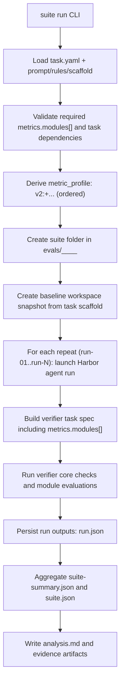

<div align="center">

<h1>Raidar</h1>

**Task evaluation of CLI harness + model pairs to improve delivery performance using Harbor-based tasks**


</div>

## Quick Install

Prerequisites:

- `uv`
- Docker with `docker compose`
- at least one provider API key in `orchestrator/.env`

Bootstrap the environment:

```bash
cp orchestrator/.env.example orchestrator/.env
make env-setup
```

## Start Here

Run one smoke suite:

```bash
make provider-validate AGENT=claude-code MODEL=anthropic/claude-haiku-4-5
make suite-run \
  TASK=tasks/hello-world-smoke/v001/task.yaml \
  AGENT=claude-code \
  MODEL=anthropic/claude-haiku-4-5 \
  REPEATS=1 \
  REPEAT_PARALLEL=1 \
  RETRY_VOID=0
```

This writes canonical artifacts into `evals/`, including per-run `run.json`, suite-level `suite.json`, `suite-summary.json`, and `analysis.md`.

## Review Workflow

The active review workflow is local artifact analysis based on [docs/analyze-results.md](/Users/adamjackson/Projects/typescript-ui-eval/docs/analyze-results.md).

- `evals/.../run.json` is the canonical per-run scorecard and evidence pointer.
- `evals/.../suite-summary.json` is the canonical repeat-suite aggregate.
- `evals/.../analysis.md` is the human-readable suite summary generated from the same canonical data.
- `make evals-list` and `make evals-prune` are the supported artifact inspection helpers.

`docs/analyze-results.md` is preserved as the reference review prompt and should guide any replacement dashboard or analysis surface built in-repo.

## System Overview

The repository has three primary concerns:

- `orchestrator/`: CLI and runtime pipeline that executes and scores tasks.
- `tasks/`: versioned task definitions (`task.yaml`), prompts, rules, references, and scaffolds.
- `evals/`: generated suite artifacts with per-run evidence bundles.

A task consists of:

- task instruction
- rules
- scaffold
- metrics via ordered `metrics.modules[]` in `task.yaml`
- derived `metric_profile` in format `v2:<module-id>+...`

## Orchestrator Flow


```mermaid
flowchart TD
    A["suite run CLI"] --> B["Load task.yaml + prompt/rules/scaffold"]
    B --> C["Validate required metrics.modules[] and task dependencies"]
    C --> D["Derive metric_profile: v2:<module-id>+... (ordered)"]
    D --> E["Create suite folder in evals/<timestamp>__<task>__<version>"]
    E --> F["Create baseline workspace snapshot from task scaffold"]
    F --> G["For each repeat (run-01..run-N): launch Harbor agent run"]
    G --> H["Build verifier task spec including metrics.modules[]"]
    H --> I["Run verifier core checks and module evaluations"]
    I --> J["Persist run outputs: run.json"]
    J --> K["Aggregate suite-summary.json and suite.json"]
    K --> L["Write analysis.md and evidence artifacts"]
```

## Key Actions

From the repo root:

```bash
make env-setup
make provider-list
make provider-validate AGENT=codex-cli MODEL=codex/gpt-5.2-high
make task-init TASK_DIR=tasks/new-task TASK_VERSION=v001
make task-info TASK_DIR=tasks/homepage-implementation/v001
make task-validate TASK=tasks/homepage-implementation/v001/task.yaml
make suite-run TASK=... AGENT=... MODEL=...
make matrix-run TASK=... CONFIG=matrix.yaml
make evals-list
make evals-prune KEEP_PER_MODEL=1
make quality
```

Detailed command policy: [docs/command-surface.md](/Users/adamjackson/Projects/typescript-ui-eval/docs/command-surface.md)
