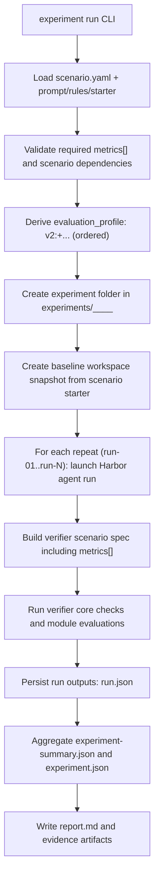

<div align="center">

<h1>Raidar</h1>

**Scenario evaluation of CLI agent + model pairs to improve delivery performance using Harbor-based runs**


</div>

## Quick Install

Prerequisites:

- `uv`
- Docker with `docker compose`
- at least one provider API key in `orchestrator/.env`

Bootstrap the environment:

```bash
cp orchestrator/.env.example orchestrator/.env
make env-setup
```

## Start Here

Run one smoke experiment:

```bash
make agent-validate AGENT=claude-code MODEL=anthropic/claude-haiku-4-5
make experiment-run \
  SCENARIO=scenarios/hello-world-smoke/v001/scenario.yaml \
  AGENT=claude-code \
  MODEL=anthropic/claude-haiku-4-5 \
  RUN_COUNT=1 \
  RUN_PARALLELISM=1 \
  RERUN_UNSCORED=0
```

This writes canonical artifacts into `experiments/`, including per-run `run.json`, experiment-level `experiment.json`, `experiment-summary.json`, and `report.md`.

## Review Workflow

The active review workflow is local artifact analysis based on [docs/analyze-results.md](/Users/adamjackson/Projects/raidar/docs/analyze-results.md).

- `experiments/.../runs/*/run.json` is the canonical per-run scorecard and evidence pointer.
- `experiments/.../experiment-summary.json` is the canonical repeat aggregate.
- `experiments/.../report.md` is the human-readable experiment summary generated from the same canonical data.
- `make experiments-list` and `make experiments-prune` are the supported artifact inspection helpers.

`docs/analyze-results.md` is preserved as the reference review prompt and should guide any replacement dashboard or analysis surface built in-repo.

## System Overview

The repository has three primary concerns:

- `orchestrator/`: CLI and runtime pipeline that executes and scores scenarios.
- `scenarios/`: versioned scenario definitions (`scenario.yaml`), prompts, rules, references, and starters.
- `experiments/`: generated experiment artifacts with per-run evidence bundles.

A scenario consists of:

- task instruction
- rules
- starter
- metrics via ordered `metrics[]` in `scenario.yaml`
- derived `evaluation_profile` in format `v2:<metric-id>+...`

## Orchestrator Flow


```mermaid
flowchart TD
    A["experiment run CLI"] --> B["Load scenario.yaml + prompt/rules/starter"]
    B --> C["Validate required metrics[] and scenario dependencies"]
    C --> D["Derive evaluation_profile: v2:<metric-id>+... (ordered)"]
    D --> E["Create experiment folder in experiments/<timestamp>__<scenario>__<revision>"]
    E --> F["Create baseline workspace snapshot from scenario starter"]
    F --> G["For each repeat (run-01..run-N): launch Harbor agent run"]
    G --> H["Build verifier scenario spec including metrics[]"]
    H --> I["Run verifier core checks and module evaluations"]
    I --> J["Persist run outputs: run.json"]
    J --> K["Aggregate experiment-summary.json and experiment.json"]
    K --> L["Write report.md and evidence artifacts"]
```

## Key Actions

From the repo root:

```bash
make env-setup
make agent-list
make agent-validate AGENT=codex-cli MODEL=codex/gpt-5.2-high
make scenario-init SCENARIO_DIR=scenarios/new-scenario SCENARIO_REVISION=v001
make scenario-info SCENARIO_DIR=scenarios/homepage-implementation/v001
make scenario-validate SCENARIO=scenarios/homepage-implementation/v001/scenario.yaml
make experiment-run SCENARIO=... AGENT=... MODEL=...
make matrix-run SCENARIO=... CONFIG=matrix.yaml
make experiments-list
make experiments-prune KEEP_PER_MODEL=1
make quality
```

Detailed command policy: [docs/command-surface.md](/Users/adamjackson/Projects/raidar/docs/command-surface.md)
