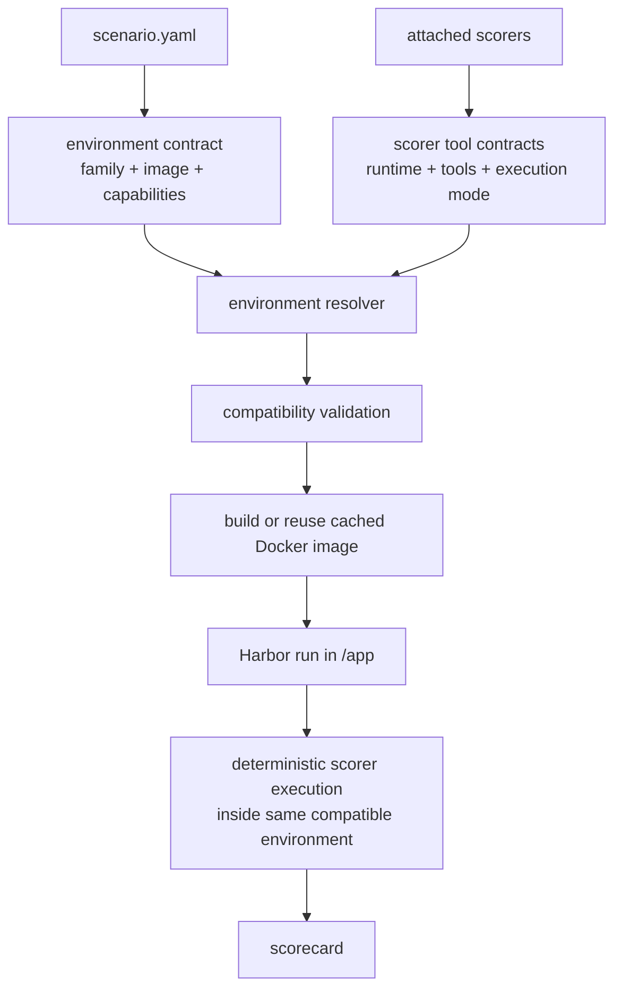
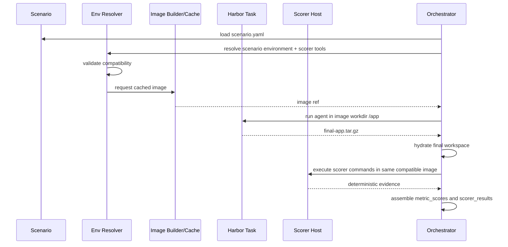

# Orchestration Environment Amendments

## Goal

Make scenario execution and deterministic scoring run against an explicit,
compatible Docker environment instead of relying on the local orchestrator
machine for scorer-owned tools.

The immediate driver is `python-code-task-baseline`: the scenario produces Python
code, the `python-code-task` scorer runs deterministic Python tools such as Ruff,
Pytest, Coverage, and Lizard, but those scorer tools currently run from the
orchestrator Python environment after Harbor has exported the final `/app`
workspace. That is fragile because the scoring host is implicit and can drift
from the experiment environment.

## Current State

Scenario YAML defines the scenario, verification settings, and scorer refs. It
does not define a runtime environment contract beyond the implicit starter app
shape and verification commands.

The Harbor task image is generated in code:

- `create_harbor_task_bundle(...)` copies the prepared workspace into
  `bundle/environment/app`.
- `_render_environment_dockerfile(...)` emits a fixed Dockerfile starting from
  `oven/bun:1`.
- The generated image installs `git`, optionally installs a harness CLI through
  `npm`, runs `bun install --frozen-lockfile`, optionally adds visual/browser
  dependencies, and copies the app to `/app`. The new design should treat that
  harness/runtime coupling as something to remove, not preserve.
- `_task_image_reference(...)` creates a content-addressed cached image key from
  the generated Dockerfile, app fingerprint, verifier tests fingerprint, harness,
  and harness CLI version.

After Harbor runs:

- The verifier script archives `/app` to `/logs/agent/final-app.tar.gz`.
- The orchestrator extracts that archive back into the local run workspace.
- `build_scorecard(...)` calls `build_metric_scores(...)`.
- `build_metric_scores(...)` instantiates each configured scorer and calls
  `collect_evidence(...)`.
- `PythonCodeTask.collect_evidence(...)` runs `sys.executable -m ruff check .`
  with `cwd=context.workspace`, where `context.workspace` is the hydrated local
  copy of final `/app`.

This means Ruff is currently an orchestrator-host dependency, not a task
environment dependency.

## Problem

The environment selection model is too weak for language-specific deterministic
scoring.

Current limitations:

- A scenario cannot declare the Docker image family required to execute the task.
- Scorers cannot declare the tools they need in a machine-readable way.
- The orchestrator does not validate scenario environment compatibility against
  attached scorers.
- Deterministic scoring runs outside the task container, even when the tools are
  naturally part of the task environment.
- The generated Dockerfile assumes a Bun/Node starter, which is a poor fit for a
  Python coding scenario.
- `ScenarioDefinition.dockerfile` exists, but the Harbor bundle path currently
  renders its own Dockerfile and does not use that field as the image selector.
- The verifier runtime is also implicitly Bun/Node: the generated `test.sh`
  invokes `bun run score-scenario.mjs`. Under the new canonical approach, this
  must be migrated rather than forcing Bun into non-Node task images.
- Python scorer evidence is not only external tools. `py_compile` and AST
  parsing also run on the host today, which can drift from the Python version in
  the experiment image.

## Target Model

Scenario owns the compatible execution image. Scorers own deterministic tool
requirements. The orchestrator resolves both into a reusable task/scoring
environment.



The first run can be slow because the image may need to build. Subsequent runs
should hit the warmed image cache unless the environment contract, scorer tool
set, starter fingerprint, or relevant image source changes.

## Scenario Contract

Add an `environment` block to `scenario.yaml`.

Initial schema:

```yaml
environment:
  id: python-3.12
  family: python
  image: raidar/python:3.12-code
  workdir: /app
  build:
    source: library
    dockerfile: environments/python/3.12/Dockerfile
  resources:
    cpus: 2
    memory_mb: 4096
    storage_mb: 10240
  allow_internet: true
```

Field intent:

- `id`: stable logical environment id used in cache keys and reporting.
- `family`: broad compatibility family such as `node`, `python`, or
  `python-node`.
- `image`: image reference Harbor should run. This can be prebuilt or built from
  the library Dockerfile.
- `workdir`: container workspace path, default `/app`.
- `build.source`: `library`, `inline`, or `external`.
- `build.dockerfile`: repo-local Dockerfile path for `library` builds.
- `resources`: Harbor runtime resources, replacing hard-coded task TOML values
  where present.
- `allow_internet`: task environment network policy, replacing the current
  hard-coded `true`.

For `python-code-task-baseline`, the contract should select a Python-capable
image that includes only the scenario runtime plus scorer-declared tools:

- Python 3.12 or the selected Python baseline version.
- `pytest`.
- `coverage`.
- `ruff`.
- `lizard`.
- `git`.
- enough shell/coreutils support for archiving and orchestration.

Bun/Node must not be included in this Python image unless a scorer tool
requirement or the scenario environment contract explicitly requires it. The
current Bun verifier must therefore move out of the Python task image path or be
replaced by a runtime-neutral verifier before Python scenarios are migrated.

## Environment Library

Add a repo-local environment library.

Proposed layout:

```text
environments/
  python/
    3.12/
      environment.yaml
      Dockerfile
  node/
    20-bun/
      environment.yaml
      Dockerfile
  typescript/
    5-bun/
      environment.yaml
      Dockerfile
  web/
    node-visual/
      environment.yaml
      Dockerfile
```

The library is organized by runtime/language, not scorer name. A scorer can
declare tools, but it must not name or own a Docker image. Scenarios select the
runtime image family and version; scorer tool metadata augments and validates
that selection.

`environment.yaml` should define metadata and capability labels:

```yaml
id: python-3.12
family: python
version: 1
image: raidar/python:3.12-code
capabilities:
  runtimes:
    python: "3.12"
  tools:
    ruff: ">=0.14"
    pytest: ">=9"
    coverage: ">=7"
    lizard: ">=1.17"
```

The initial library should include:

- `python/3.12`: Python task/runtime image for Python coding scenarios.
- `node/20-bun`: Node/Bun task/runtime image for current Node scenarios.
- `typescript/5-bun`: TypeScript-focused image if TypeScript scoring requires
  different tool guarantees than generic Node.
- `web/node-visual`: browser-capable web image for visual scenarios.

No library image should inherit tools from the current generated Dockerfile just
because that is what Raidar used before. The contents of each image must be
derived from the scenario runtime contract plus scorer tool contracts.

Harness execution dependencies must not mutate the scenario/scorer task image.
If a harness needs a CLI runtime, such as Codex CLI needing its own install
mechanism, that belongs in a separate harness execution layer or sidecar. The
task image remains the environment under test plus deterministic scorer tools.

## Scorer Tool Contract

Add machine-readable tool metadata to scorer classes. This belongs in the scorer
file, not in scenario YAML.

Example:

```python
@register_scorer(scorer_id="python-code-task", version=1)
class PythonCodeTask(CodeTaskScorer):
    runtime = "python"
    tool_requirements = (
        ScorerToolRequirement(name="ruff", module="ruff", min_version="0.14"),
        ScorerToolRequirement(name="pytest", module="pytest", min_version="9"),
        ScorerToolRequirement(name="coverage", module="coverage", min_version="7"),
        ScorerToolRequirement(name="lizard", module="lizard", min_version="1.17"),
    )
```

Contract fields should support:

- `name`: stable tool id.
- `module`: Python module if invoked with `python -m`.
- `binary`: binary name if invoked directly.
- `min_version`: optional compatibility floor.
- `runtime`: optional runtime override when a scorer uses tools outside its
  primary runtime.
- `execution_mode`: `container`, `hostless`, or `llm`.

`BaseScorer.definition()` should expose these tool requirements so the
orchestrator can resolve them before the run starts.

The metadata must survive the full registry path. `ScorerDefinition`,
`ResolvedScorer`, scenario resolution, scenario spec rendering, and scorecard or
report metadata should all preserve enough runtime/tool information to explain
why an environment was selected and why validation failed.

## Compatibility Rules

Before building or running a scenario, validate:

- Every attached scorer's runtime family is compatible with
  `scenario.environment.family`.
- Every scorer tool requirement is provided by the selected environment library
  metadata, or by an explicit scenario environment capability.
- The selected environment contents are derived only from scenario runtime,
  scenario version, and scorer tool requirements. No legacy default runtime or
  hidden tool may be injected.
- Deterministic tool scorers must run in the selected environment. Host
  execution is not a fallback.
- LLM-as-judge scorers do not need container tool support, but their evidence
  paths must still point at the same final workspace.
- Analysis-only scorers that only inspect files should still execute through the
  canonical scorer execution interface. They may not require external tools, but
  they should not create a second implicit host environment pathway.

Validation failures should happen before Harbor execution and should produce a
clear error such as:

```text
Scenario python-code-task-baseline uses environment node/20-bun, but scorer
python-code-task@1 requires runtime python and tools: ruff, pytest, coverage,
lizard.
```

Environment resolution should be a separate path-aware phase, not only a
Pydantic model validator. `ScenarioDefinition.from_yaml()` currently has the
scenario data but not enough repo-root/path context to resolve library Dockerfile
paths safely. Keep schema validation structural; resolve and validate
environment library entries from a service that receives the scenario path and
repo root.

## Scorer Execution Host

Introduce a scorer execution host abstraction.

```text
ScorerHost
  DockerScorerHost       run scorer commands inside selected environment image
```

The scorer should not call `subprocess.run(...)` directly for deterministic
tools. Instead it should request command execution through the scorer context:

```python
context.tools.run_python_module("ruff", "check", ".")
```

or:

```python
context.command_runner.run(("python", "-m", "ruff", "check", "."))
```

The runner owns:

- where the command runs;
- environment variables;
- timeout handling;
- cwd mapping;
- stdout/stderr capture;
- optional output sanitization;
- command evidence shape.

For Docker execution, command cwd should be `/app`, with the final workspace
mounted or copied into the container. The simplest first implementation is a
short-lived `docker run --rm` per scorer command using the resolved image and a
bind mount of the hydrated workspace to `/app`. A later optimization can run a
single scorer container per run and execute all scorer commands inside it.

There should be no `LocalScorerHost` fallback in the completed design. During
implementation, any temporary host path must be private to an intermediate
branch and removed before scenarios are migrated. The shipped behavior should
fail closed if a selected environment cannot run its declared scorer tools.

The scorer host must share the same image backend contract as Harbor. If Harbor
uses a local Docker image built by `_ensure_task_image(...)`, a local Docker
scorer host can reuse that image. If Harbor later uses a remote backend or a
non-Docker namespace, scorer execution must either run through that same backend
or explicitly materialize the scorer image locally with a preflight check.

Containerized command execution also needs container-visible temp/output paths.
The current coverage flow writes `COVERAGE_FILE` and `coverage.json` under a host
temp directory. In a Docker scorer host, those paths should live under a mounted
scorer work directory, such as `/raidar-scorer`, and be copied or mapped back to
the host before parsing.

Python scorer migration should move all Python-version-sensitive checks into
the selected runtime. That includes compile checks and AST parsing, not only
Ruff, Pytest, Coverage, and Lizard. If any analysis remains host-side, the plan
must state why it is version-insensitive.

## Verifier Runtime Migration

The current verifier is a JS/Bun script. The generated task `test.sh` runs:

```text
bun run "$SCRIPT_DIR/score-scenario.mjs" "$SCRIPT_DIR/scenario-spec.json"
```

That currently creates an invalid hidden Node/Bun dependency for every scenario.
The new environment contract should not carry that dependency forward. Verifier
execution must be changed so that a Python task image does not need Bun unless
the scenario or a scorer explicitly asks for Bun.

Acceptable migration options:

- Move verifier execution outside the task image into an orchestrator-owned
  verifier environment.
- Replace the JS verifier with a runtime-neutral verifier that does not impose
  Node/Bun on task images.
- Provide verifier adapters per runtime, selected by the same scenario
  environment contract.

Unacceptable migration option:

- Add Bun to Python images solely because the old verifier needs it.

This makes verifier migration a blocker for moving Python scenarios to the new
canonical environment system.

## Runtime Flow

Proposed flow:



## Cache Key Changes

Task image cache keys should include:

- environment id;
- environment version;
- environment Dockerfile fingerprint;
- environment metadata fingerprint;
- scorer tool requirement fingerprint;
- starter/app fingerprint;
- verifier tests fingerprint;
- visual flag and visual dependency set when applicable.

This preserves the cold/warm behavior:

- cold run builds the environment image;
- warm run reuses the image when all compatibility inputs match;
- experiment artifacts can still be cleared between runs without invalidating the
  image cache.

## Migration Plan

### Phase 1: Contract and Library Skeleton

- Add `EnvironmentConfig` to the scenario schema.
- Keep the schema structural only. Add path-aware environment resolution in a
  service that receives repo root and scenario path.
- Require explicit environment declarations for every migrated scenario:
  - visual scenarios declare the appropriate web/visual runtime;
  - Node/Bun scenarios declare the Node/Bun runtime;
  - Python code-task scenarios declare the Python runtime once the bundle image
    path uses the declared environment.
- Add `environments/` with metadata and Dockerfiles.
- Update `scenario-init` to include an environment block.
- Update `scenario-info` to print environment id/family/image.
- Update scenario validation to resolve the environment library entry.
- Do not mark a scenario environment as authoritative until
  `create_harbor_task_bundle(...)` consumes it. Otherwise the repo can validate a
  Python environment while still running the old generated Bun-only Dockerfile.
- Do not provide legacy defaults for scenarios missing `environment`. New
  validation should fail until each affected scenario is migrated.

### Phase 2: Scorer Tool Metadata

- Add `ScorerToolRequirement` and expose it from `ScorerDefinition`.
- Add tool metadata to `python-code-task`.
- Add explicit empty tool metadata for requirements, resource-efficiency, and
  analysis-only scorers.
- Add compatibility validation between `ScenarioDefinition.environment` and
  resolved scorer definitions.
- Extend `ResolvedScorer` and any reporting/spec surfaces that need to carry
  runtime/tool metadata.

### Phase 3: Task Image Resolution

- Replace `_render_environment_dockerfile(...)` with an environment-aware
  renderer/resolver.
- Recreate affected existing behavior only as explicit runtime library entries,
  such as `node/20-bun` and `web/node-visual`.
- Extend `_task_image_reference(...)` to include environment metadata and scorer
  tool fingerprints.
- Split harness CLI installation from task image resolution so harness
  dependencies do not inject runtimes or tools into scenario environments.
- Complete verifier runtime migration before migrating Python scenarios. Python
  task images must not include Bun solely for verifier compatibility.

### Phase 4: Containerized Scorer Commands

- Add `CommandRunner` or `ScorerHost` to `ScorerContext`.
- Refactor `PythonCodeTask` to use the runner instead of direct
  `subprocess.run(...)`.
- Implement `DockerScorerHost` using the selected image and mounted final
  workspace.
- Move `py_compile` and AST/static-shape checks into the selected Python runtime
  or explicitly justify any host-side residual analysis.
- Add mounted scorer temp/output handling for coverage and other tools that
  write files.
- Remove host fallback behavior before the new environment contract becomes
  canonical.
- Persist scorer command evidence in the scorecard metadata so failures show the
  image, command, cwd, exit code, and sanitized output.

### Phase 5: End-to-End Scenario Migration

- Update `python-code-task-baseline/v001/scenario.yaml` to use the
  `python/3.12` environment.
- Migrate all affected scenarios to explicit `environment` blocks. Scenarios
  without an environment contract should fail validation.
- Verify first-run image build and second-run image cache hit.
- Verify Ruff runs inside the selected Docker image, not on the local
  orchestrator host.
- Verify the selected Python image has no Bun/Node unless explicitly required by
  scenario or scorer metadata.
- Verify verifier execution no longer forces Bun into the Python task image and
  still produces the required execution outputs and `final-app.tar.gz`.
- Verify existing Node and visual scenarios use explicit Node/web environment
  contracts rather than implicit generated images.
- Verify Codex CLI execution still works without adding Codex/NPM/Node
  dependencies to the Python task image unless they are declared by scenario or
  scorer metadata.
- Add regression tests for:
  - environment schema validation;
  - scorer/environment compatibility failure;
  - declared environment is actually consumed by the Harbor task bundle;
  - verifier runtime decoupling and final archive production;
  - task image cache key changes;
  - scorer command runner cwd and evidence capture;
  - Python scorer command execution through the runner.

## Resolved Decisions

- Scorer commands should run inside the same Harbor task container before the
  final archive is produced. This is less memory intensive than running multiple
  copies of the same image and keeps deterministic scoring in the exact
  environment where the work happened. The implementation implication is that
  Harbor needs an explicit post-agent scoring phase before `final-app.tar.gz`
  export, because scorecard synthesis currently happens after Harbor has
  completed and after the archive has been hydrated locally.
- Environment images may be built locally or referenced by pinned remote image
  digest. Both are valid as long as the resolved image identity is included in
  cache keys, scorecard metadata, and validation output.
- Scenario-level environment capabilities should not override library metadata.
  The environment library is the source of truth. Scenario setup should create
  or select an appropriate library image, and validation should fail if the
  scenario runtime and attached scorer tools are incompatible with that image.
- Python task images must not carry Bun solely for verifier compatibility. The
  scenario declares Python, and `python-code-task` scorer tools are Python
  tools: Ruff, Pytest, Coverage, Lizard, compile checks, and AST/static checks.
  If a future scorer declares a Bun-dependent tool, then Bun can enter through
  that scorer tool contract. Otherwise verifier execution must be migrated so it
  does not impose Bun on Python images.

## Required Commands and Verification Gates

Keep `required_commands` and `verification.gates` as separate concepts.

Current distinction:

- `verification.required_commands` describes commands the agent is expected to
  run during its work. The orchestrator later inspects harness command logs and
  records whether those commands were attempted, first-pass status, missing
  commands, and repeated failures. This is process evidence about the agent's
  workflow.
- `verification.gates` describes commands the verifier runs itself inside the
  task environment. These are deterministic pass/fail checks owned by the
  orchestration system, not by the agent.

For Python coding tasks, Ruff/Pytest/Coverage/Lizard should be scorer-owned
deterministic tools, not required commands.

## Recommended First Slice

Implement the canonical contract and migrate the image path in one coherent
slice:

1. Add `environment` to scenario schema.
2. Add environment library metadata by runtime/language, starting with
   `python/3.12`, `node/20-bun`, and `web/node-visual`.
3. Add scorer tool metadata to `python-code-task`.
4. Add path-aware environment resolution and compatibility validation.
5. Replace generated Dockerfile selection with declared environment selection.
6. Migrate verifier execution so Python images do not need Bun.
7. Migrate `python-code-task-baseline` to `python/3.12`.
8. Migrate all affected existing scenarios to explicit environment contracts.

This avoids a false-positive state where scenario YAML says Python but Harbor
still runs the old generated image, and it avoids a hidden compatibility shim
where Python images inherit Bun from the old verifier path.

## Verification Plan

Use the public Makefile surface and a cheap Codex smoke path:

```text
make scenario-validate SCENARIO=scenarios/python-code-task-baseline/v001/scenario.yaml
make scenario-validate SCENARIO=<each migrated scenario.yaml>
make agent-smoke HARNESS=codex-cli PROVIDER=openai MODEL=gpt-5.5 AGENT_SMOKE_REASONING_EFFORT=low
make experiment-run SCENARIO=scenarios/python-code-task-baseline/v001/scenario.yaml HARNESS=codex-cli PROVIDER=openai MODEL=gpt-5.5 REASONING_EFFORT=low
make quality
```

Required evidence:

- First Python run builds or resolves the `python/3.12` image.
- Second Python run reuses the warmed image.
- Scorecard evidence shows Ruff/Pytest/Coverage/Lizard commands executed inside
  the selected image.
- The Python image inspection confirms no Bun/Node binary is present unless
  explicitly introduced by scenario or scorer metadata.
- Verifier outputs and `final-app.tar.gz` are still produced without requiring
  Bun inside the Python task image.
- Existing Node/web scenarios pass validation only after explicit environment
  migration.
- No scenario runs through an implicit generated Dockerfile or host scorer tool
  fallback.
- Codex CLI smoke uses `gpt-5.5` with low reasoning through the public Makefile
  variables and does not rely on hidden task-image dependencies.

## Plan-Judge Review Notes

A plan-judge review was run against this document. Its key amendments were
incorporated above:

- migrate the current Bun verifier runtime before introducing pure Python
  images;
- avoid migrating scenario YAML before the Harbor bundle consumes the declared
  environment;
- move host-side Python compile and AST checks into the selected runtime;
- make scorer host execution share Harbor's image backend contract;
- map temp/output paths for containerized coverage;
- resolve environment library paths outside bare Pydantic validation;
- preserve scorer runtime/tool metadata through registry resolution and reports;
- test verifier compatibility and final archive production.
